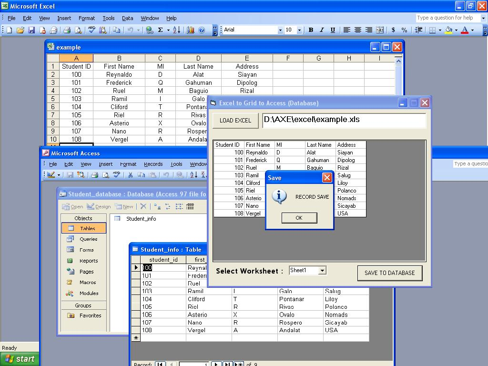



## Excel to Flexgrid to Database

### Description

Load Excel to Flexgrid and saves it to Access Database
 
### More Info
 
It is just a simple code that does not affect anything

             |
---                |---
**Submitted On**   |2007-02-12 14:48:12
**By**             |[Arthur Sa&\#241;ulom](https://github.com/Planet-Source-Code/PSCIndex/blob/master/ByAuthor/arthur-sa-241-ulom.md)
**Level**          |Beginner
**User Rating**    |4.8 (19 globes from 4 users)
**Compatibility**  |VB 5\.0, VB 6\.0
**Category**       |[Complete Applications](https://github.com/Planet-Source-Code/PSCIndex/blob/master/ByCategory/complete-applications__1-27.md)
**World**          |[Visual Basic](https://github.com/Planet-Source-Code/PSCIndex/blob/master/ByWorld/visual-basic.md)
**Archive File**   |[Excel\_to\_F2049032202007\.zip](https://github.com/Planet-Source-Code/arthur-sa-241-ulom-excel-to-flexgrid-to-database__1-67923/archive/master.zip)

